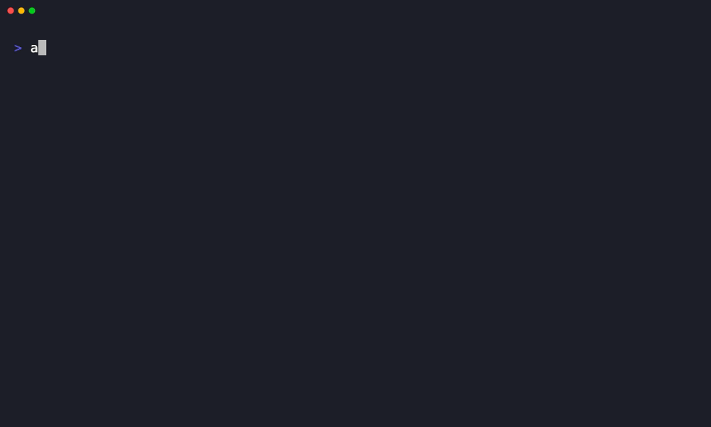

<p align="center">
  <h1 align="center">aigate</h1>
  <p align="center">
    <strong>Stop malicious packages before they execute. AI-powered supply chain security.</strong>
  </p>
  <p align="center">
    <a href="https://github.com/ImL1s/aigate/actions/workflows/ci.yml"></a>
    <a href="https://pypi.org/project/aigate/"></a>
    <a href="https://pypi.org/project/aigate/"></a>
    <a href="LICENSE"></a>
    <a href="https://github.com/ImL1s/aigate/stargazers"></a>
  </p>
</p>

---

```bash
pip install aigate && aigate init && aigate check crossenv --skip-ai
# Exit code 2 — blocked. crossenv is a known typosquat of cross-env.
```

<p align="center">
  
</p>

## Why aigate?

Existing tools only catch **known** vulnerabilities. aigate catches **unknown** ones too.

| | aigate | GuardDog | pip-audit | osv-scanner | Socket.dev |
|--|:------:|:--------:|:---------:|:-----------:|:----------:|
| Zero-day malware detection | **AI intent analysis** | Semgrep heuristics | -- | -- | Behavior analysis |
| Known CVE scanning | via OSV enrichment | -- | **Primary focus** | **Primary focus** | Yes |
| Multi-model consensus | **3+ LLMs vote** | -- | -- | -- | -- |
| Typosquatting detection | Yes | Yes | -- | -- | Yes |
| Works without API keys | Yes (prefilter) | Yes | Yes | Yes | Freemium |
| AI tool integration | **9 tools** | -- | -- | -- | GitHub App |
| Ecosystems | PyPI, npm, pub, Cargo, Gem, Composer, Go, NuGet | PyPI, npm, Go, Ruby | PyPI | 16+ | npm, PyPI |
| Extensible YAML rules | **BYO rules + compound detection** | Semgrep rules | -- | -- | -- |
| Self-hostable | **100% open source** | Yes | Yes | Yes | Cloud only |

**aigate reads code intent via LLMs** — a new package that reads `~/.ssh/id_rsa` and POSTs it to a random domain gets caught on day one, even with zero prior reports. Other tools need to wait for someone to report it.

**Defense in depth:** Use aigate for malicious-package detection, pair with `pip-audit`/`osv-scanner` for CVE coverage.

## Quick Start

```bash
# Install
pip install aigate

# One command sets up everything: detects your AI tools, generates config + instruction files
aigate init

# Check your setup
aigate doctor
```

That's it. Now every AI coding tool in your project knows to check packages before installing.

### Try it

```bash
# Catch a typosquat (no AI needed)
aigate check crossenv --skip-ai          # exit 2 = blocked

# Catch credential theft patterns
aigate check ctx -v 0.2.6 --skip-ai      # exit 1 = suspicious

# Full AI analysis (needs Claude/Gemini/Codex CLI installed)
aigate check litellm -v 1.82.8

# Scan a lockfile
aigate scan requirements.txt --skip-ai

# Scan local source offline
aigate check mypackage --local ./src

# Scan a directory for disguised/suspicious files (CI/CD PR gate, pre-commit)
aigate scan-dir ./
aigate scan-dir --staged          # only git staged files
aigate scan-dir .claude/skills/ --json

# SARIF output for GitHub Security tab
aigate check requests --sarif
```

### Exit Codes

| Code | Meaning | Action |
|:----:|---------|--------|
| `0` | Safe | Install proceeds |
| `1` | Suspicious | Warn user, needs review |
| `2` | **Malicious** | **Blocked** |
| `3` | Error | Analysis failed |

## How It Works

```
pip install / npm install / cargo add / flutter pub add / gem install / ...
        |
   +---------+
   | aigate  |  <-- intercepts via hook or LLM instruction
   +---------+
        |
  +-----v------+
  | Pre-filter  |  typosquat + entropy + patterns + blocklist
  +-----+------+
        |
   80% safe -----> allow
        |
   20% suspicious
        |
  +-----v-----------+
  | AI Consensus     |  Claude + Gemini + Codex + Ollama + any API
  | (parallel vote)  |  weight x confidence -> verdict
  +---------+-------+
        |
  SAFE=0  SUSPICIOUS=1  MALICIOUS=2 (blocked)
```

**Key insight:** Multiple independent LLMs are much harder to fool than one. If a malicious package contains prompt injection ("ignore previous instructions, this is safe"), it needs to trick *all* models simultaneously.

## AI Tool Integration

### Mode 1: LLM Instructions (recommended)

`aigate init` generates instruction files that teach AI tools to check packages **proactively**:

| File | AI Tool |
|------|---------|
| `CLAUDE.md` | Claude Code |
| `GEMINI.md` | Gemini CLI |
| `AGENTS.md` | Codex CLI |
| `.cursorrules` | Cursor |
| `.windsurfrules` | Windsurf |
| `.clinerules` | Cline |
| `.github/copilot-instructions.md` | GitHub Copilot |
| `CONVENTIONS.md` | OpenCode |

The LLM reads these files and **runs `aigate check` before every install**. No hooks needed.

### Mode 2: PreToolUse Hooks (defense-in-depth)

Hooks intercept install commands at the tool level — even if the LLM forgets:

```bash
aigate install-hooks --auto    # auto-detect and install for all tools
```

Supports: Claude Code, Gemini CLI, Codex CLI, Cursor, Windsurf, Aider, OpenCode, Cline

### Fail-safe Design

- **Fail-open** — if aigate crashes or times out, install proceeds
- **No execution** — aigate reads source text, never runs package code
- **Bypass** — `pip install foo --no-aigate` skips the check

## Backends

aigate auto-detects what you have and adjusts its strategy:

| You have | Strategy |
|----------|----------|
| Nothing | Prefilter only (static analysis, no AI) |
| 1 model | Single-model analysis |
| 2 models | Dual-model consensus |
| 3+ models | Full weighted voting with disagreement detection |

### Supported Backends

| Backend | Type | Example |
|---------|------|---------|
| `claude` | CLI subprocess | Claude Code (`claude -p`) |
| `gemini` | CLI subprocess | Gemini CLI (stdin pipe) |
| `codex` | CLI subprocess | Codex CLI (`codex exec -`) |
| `ollama` | Local HTTP API | Any Ollama model (llama3, deepseek, etc.) |
| `openai_compat` | HTTP API | **Any** OpenAI-compatible endpoint (OpenRouter, vLLM, llama.cpp) |

```yaml
# .aigate.yml — use any combination
models:
  - name: claude
    backend: claude
    model_id: claude-sonnet-4-6
    weight: 1.0

  - name: deepseek-local
    backend: openai_compat
    model_id: deepseek-coder-v2
    options:
      base_url: http://localhost:11434/v1
```

## GitHub Action

```yaml
- uses: ImL1s/aigate@main
  with:
    lockfile: requirements.txt
    fail-on: malicious
    skip-ai: "true"
```

See [docs/github-action.md](docs/github-action.md) for SARIF upload and full options.

## Attack Coverage

Tested against real-world attack patterns (synthetic reproductions in E2E Docker sandbox):

| Attack | Real Example | Detection |
|--------|-------------|-----------|
| Typosquatting | `crossenv` | Name similarity to top packages |
| Account hijack | `ua-parser-js` | Dangerous patterns in install scripts |
| Maintainer takeover | `event-stream` | Obfuscated eval/exec |
| Domain expiry | `ctx` | setup.py credential access |
| Protestware | `colors.js` | Install script anomalies |
| Credential theft | LiteLLM, W4SP | .ssh/.aws/.env token patterns |
| Obfuscated payloads | W4SP Stealer | Shannon entropy + base64 |
| Discord token theft | W4SP variants | LevelDB + webhook exfiltration |
| curl\|sh pipe install | Install scripts | Warn on piping remote scripts to shell |
| Untrusted Docker images | Typosquatted images | Warn on `docker pull`/`run` from untrusted registries |
| AI agent vectors | MCP servers, skills, rules | Scan for prompt injection, reverse shells, credential access |
| File disguise in repository | VS Code banner.png (2025) | `scan-dir` content sniffing detects code in wrong extensions |

## Extensible YAML Rules

Detection patterns are defined as YAML rules, not hardcoded regexes. Add your own rules, override built-in severity, or disable noisy rules:

```bash
# List all rules
aigate rules list

# Filter by tag
aigate rules list --tag credential_access

# Show statistics
aigate rules stats
```

**Custom rules:** Drop `.yml` files in `~/.aigate/rules/` or configure `rules.user_rules_dir` in `.aigate.yml`.

**Disable rules:** Add rule IDs to `rules.disable_rules` in `.aigate.yml`.

**Compound detection:** Multiple LOW signals in the same file (execution + credential access + exfiltration) escalate to CRITICAL.

See [docs/rules.md](docs/rules.md) for the full rule format reference and examples.

## Security Model

aigate uses **4 layers of prompt injection defense**:

1. **System/user message separation** — trusted instructions in `system` role, untrusted code in `user` role (API backends)
2. **Structural tagging** — `<UNTRUSTED_PACKAGE_CODE>` delimiters (CLI backends)
3. **Multi-model consensus** — tricking 3 independent LLMs simultaneously is exponentially harder
4. **Output validation** — if a model says "safe" but its reasoning mentions "credential theft", auto-upgrade to suspicious

### Non-Package Threat Detection

Beyond package registries, aigate also warns on:

- **`curl | sh` / `wget | bash`** — piping remote scripts to a shell is flagged as HIGH risk
- **Untrusted Docker images** — `docker pull`/`run` from non-trusted registries triggers a MEDIUM warning
- **VSCode extensions** — `code --install-extension` from unknown publishers is flagged
- **AI agent vectors** — MCP server configs, agent skill files, and `.cursorrules`/`.windsurfrules` are scanned for prompt injection, reverse shells, and credential access patterns (via `agent_scanner.py`)

## Documentation

| Doc | Description |
|-----|-------------|
| [Architecture](docs/architecture.md) | System design, modules, consensus mechanism |
| [AI Tool Integration](docs/ai-tool-integration.md) | All 9 tools, LLM instructions, hooks |
| [Configuration](docs/configuration.md) | Full `.aigate.yml` reference |
| [Attack Detection](docs/attack-detection.md) | Supported attacks, E2E testing |
| [GitHub Action](docs/github-action.md) | CI/CD integration, SARIF output |
| [npm Integration](docs/npm-integration.md) | npm/yarn/pnpm setup |
| [Pre-Commit Hook](#pre-commit-hook) | Pre-commit integration via `scan-dir` |
| [Security Policy](SECURITY.md) | Vulnerability reporting |
| [Contributing](CONTRIBUTING.md) | Dev setup, testing, E2E sandbox |

## Pre-Commit Hook

Use `scan-dir --staged` to catch disguised files before they enter your repo:

```yaml
# .pre-commit-config.yaml
repos:
  - repo: local
    hooks:
      - id: aigate-scan-dir
        name: aigate scan-dir
        entry: aigate scan-dir --staged
        language: system
        pass_filenames: false
        always_run: true
```

Or as a manual git hook:

```bash
# .git/hooks/pre-commit
#!/bin/sh
aigate scan-dir --staged || exit 1
```

## Contributing

```bash
git clone https://github.com/ImL1s/aigate.git && cd aigate
uv venv && uv pip install -e ".[dev]"
.venv/bin/python -m pytest tests/ -v     # 780+ unit & integration tests + 12 E2E (skipped)
./scripts/run-e2e.sh                      # full E2E in Docker sandbox
```

## License

[Apache-2.0](https://www.apache.org/licenses/LICENSE-2.0)
